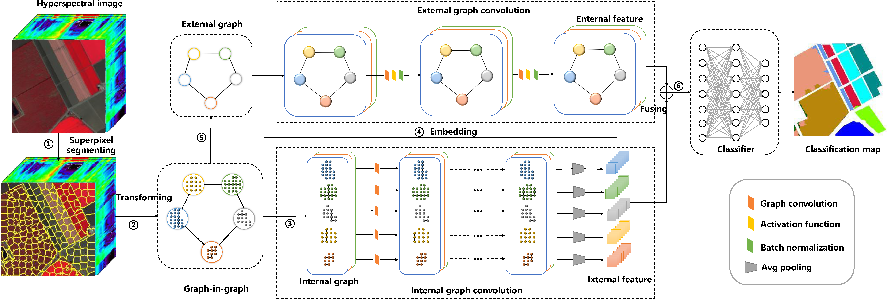
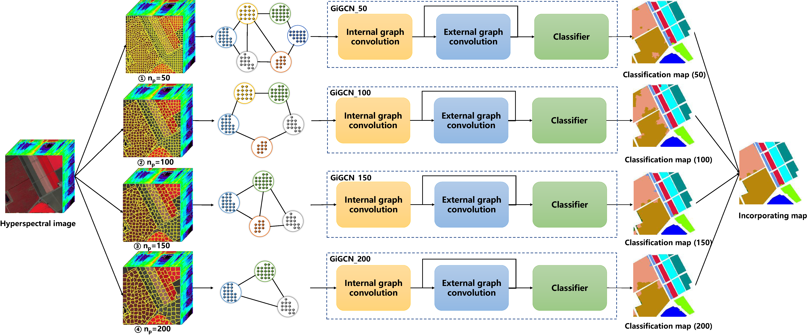

# Graph-in-Graph Convolutional Network for Hyperspectral Image Classification (TNNLS 2022)
<!-- [](https://codalab.lisn.upsaclay.fr/competitions/721#learn_the_details)
[](https://arxiv.org/abs/2204.07908)
[](https://zhuanlan.zhihu.com/p/501101943)
[](https://github.com/caiyuanhao1998/MST)
 -->

[Sen Jia](https://scholar.google.com.hk/citations?hl=zh-CN&user=UxbDMKoAAAAJ), [Shuguo Jiang](https://scholar.google.com.hk/citations?hl=zh-CN&user=B1YTGUgAAAAJ), [Shuyu Zhang](https://scholar.google.com.hk/citations?hl=zh-CN&user=O48TQQ4AAAAJ), [Meng Xu](https://scholar.google.com.hk/citations?hl=zh-CN&user=Hw1TFzQAAAAJ), [Xiuping Jia]()

*The first two authors contribute equally to this work*

<!-- #### News
- **2022.04.17 :** Our paper has been accepted by CVPRW 2022, code and models have been released. :rocket: 
- **2022.04.02 :** We win the **First** place of NTIRE 2022 Challenge on Spectral Reconstruction from RGB. :trophy: 

|             480 nm              |              520 nm              |              580 nm              |              660 nm              |
| :-----------------------------: | :------------------------------: | :------------------------------: | :------------------------------: |
|  |  |  |   | -->


<hr />

> **Abstract:** *With the development of hyperspectral sensors, accessible hyperspectral images (HSIs) are increasing, and pixel-oriented classification has attracted much attention. Recently, graph convolutional networks (GCN) have been proposed to process graph-structured data in non-euclidean domains, and have been employed in HSI classification. But most methods based on GCN are hard to sufficiently exploit information of ground objects due to feature aggregation. To solve this issue, in this paper, we proposed a graph-in-graph (GiG) model and a related GiG convolutional network (GiGCN) for HSI classification from superpixel viewpoint. The graph-in-graph representation covers information inside and outside superpixels, respectively corresponding to the local and global characteristics of ground objects. Concretely, after segmenting HSI into disjoint superpixels, each one is converted to an internal graph. Meanwhile, an external graph is constructed according to the spatial adjacent relationships among superpixels. Significantly, each node in the external graph embeds a corresponding internal graph, forming the so-called graph-in-graph structure. Then, GiGCN composed of internal and external graph convolution is designed to extract hierarchical features and integrate them into multiple scales, improving the discriminability of GiGCN. Ensemble learning is incorporated to further boost the robustness of GiGCN. It is worth noting that we are the first to propose graph-in-graph framework from superpixel point and the GiGCN scheme for HSI classification. Experiment results on four benchmark data sets demonstrate that our proposed method is effective and feasible for HSI classification with limited labeled samples. For study replication, the code developed for this study is available at https://github.com/ShuGuoJ/GiGCN.git.* 
<hr />


## Network Architecture
<!--  -->
<div aligh=center witdh="200"></div>

This is our ensemble flowchart. With the ensmeble learning, GiGCN is more robust in various scenes.

<!--  -->


## Comparison with State-of-the-art Methods
<!-- This repo is a baseline and toolbox containing 11 image restoration algorithms for Spectral Reconstruction. -->

<!-- We are going to enlarge our model zoo in the future. -->
In comparative experiments, GiGCN is compared with other eight state-of-the-art methods for hyperspectral image classification. Ten samples for each class is chosen for training models and the others are used to test. To alleviate biases, the above operation is run ten times.


<!-- <details close>
<summary><b>Supported algorithms:</b></summary>

* [x] [MST++](https://arxiv.org/abs/2111.07910) (CVPRW 2022)
* [x] [MST](https://arxiv.org/abs/2111.07910) (CVPR 2022)
* [x] [HDNet](https://arxiv.org/abs/2203.02149) (CVPR 2022)
* [x] [Restormer](https://arxiv.org/abs/2111.09881) (CVPR 2022)
* [x] [MPRNet](https://arxiv.org/abs/2102.02808) (CVPR 2021)
* [x] [HINet](https://arxiv.org/abs/2105.06086) (CVPRW 2021)
* [x] [MIRNet](https://arxiv.org/abs/2003.06792) (ECCV 2020)
* [x] [AWAN](https://arxiv.org/abs/2005.09305) (CVPRW 2020)
* [x] [HRNet](https://arxiv.org/abs/2005.04703) (CVPRW 2020)
* [x] [HSCNN+](https://openaccess.thecvf.com/content_cvpr_2018_workshops/w13/html/Shi_HSCNN_Advanced_CNN-Based_CVPR_2018_paper.html) (CVPRW 2018)
* [x] [EDSR](https://arxiv.org/abs/1707.02921) (CVPRW 2017)

</details> -->

<!--  -->

<!-- ### Results on Pavia University (PaviaU) data set - Validation
|  Method   | OA (%) | AA (%) |    kappa    |    time    |
| :-------: | :--------: | :-------: | :--------: | :--------: |
|  [Two-CNN](https://openaccess.thecvf.com/content_cvpr_2018_workshops/w13/html/Shi_HSCNN_Advanced_CNN-Based_CVPR_2018_paper.html)   |    78.20    |  76.02   |   0.71   |   0.0588   |
|   [3DVSCNN](https://arxiv.org/abs/2005.04703)   |   76.43    |  75.47   |   0.69   |   0.0550   |
|   [HSGAN](https://arxiv.org/abs/1707.02921)    |    72.17    |  74.66   |   0.64   |   0.0437   |
|   [SSLstm](https://arxiv.org/abs/2005.09305)    |    69.59    |  72.77   |   0.62   |   0.0367   |
|   [MDGCN](https://arxiv.org/abs/2203.02149)   |    75.44    |  79.75   |   0.69   |   0.0317   |
|   [S-DMM](https://arxiv.org/abs/2105.06086)   |    83.77    |   90.98   |   0.79   |   0.0303   |
|  [3DCAE](https://arxiv.org/abs/2003.06792)   |    59.14    |   71.58   |   0.51   |   0.0274   |
| [MDL4OW](https://arxiv.org/abs/2111.09881) |   76.55    |   81.42   |   0.70   |   0.0274   |
|  [**GiGCN**](https://arxiv.org/abs/2102.02808)   |    93.51    |  94.07   |   0.92   |   0.0270   |

### Results on Salinas data set - Validation
|  Method   | OA (%) | AA (%) |    kappa    |    time    |
| :-------: | :--------: | :-------: | :--------: | :--------: |
|  [Two-CNN](https://openaccess.thecvf.com/content_cvpr_2018_workshops/w13/html/Shi_HSCNN_Advanced_CNN-Based_CVPR_2018_paper.html)   |    76.37    |  85.25   |   0.74   |   0.0588   |
|   [3DVSCNN](https://arxiv.org/abs/2005.04703)   |   89.17    |  94.07   |   0.88   |   0.0550   |
|   [HSGAN](https://arxiv.org/abs/1707.02921)    |    83.44    |  89.67   |   0.82   |   0.0437   |
|   [SSLstm](https://arxiv.org/abs/2005.09305)    |    81.20    |  87.04   |   0.79   |   0.0367   |
|   [MDGCN](https://arxiv.org/abs/2203.02149)   |    93.49    |  95.60   |   0.93   |   0.0317   |
|   [S-DMM](https://arxiv.org/abs/2105.06086)   |    88.53    |   94.53   |   0.87   |   0.0303   |
|  [3DCAE](https://arxiv.org/abs/2003.06792)   |    72.64    |   75.58   |   0.70   |   0.0274   |
| [MDL4OW](https://arxiv.org/abs/2111.09881) |   82.44    |   90.57   |   0.81   |   0.0274   |
|  [**GiGCN**](https://arxiv.org/abs/2102.02808)   |    97.34    |  98.34   |   0.97   |   0.0270   |

### Results on Yellow Riever Estuary (YRE) data set - Validation
|  Method   | OA (%) | AA (%) |    kappa    |    time    |
| :-------: | :--------: | :-------: | :--------: | :--------: |
|  [Two-CNN](https://openaccess.thecvf.com/content_cvpr_2018_workshops/w13/html/Shi_HSCNN_Advanced_CNN-Based_CVPR_2018_paper.html)   |    87.08    |  82.37   |   0.85   |   0.0588   |
|   [3DVSCNN](https://arxiv.org/abs/2005.04703)   |   84.99    |  79.02   |   0.83   |   0.0550   |
|   [HSGAN](https://arxiv.org/abs/1707.02921)    |    88.84    |  81.50   |   0.87   |   0.0437   |
|   [SSLstm](https://arxiv.org/abs/2005.09305)    |    70.29    |  58.55   |   0.66   |   0.0367   |
|   [MDGCN](https://arxiv.org/abs/2203.02149)   |    85.23    |  75.60   |   0.83   |   0.0317   |
|   [S-DMM](https://arxiv.org/abs/2105.06086)   |    88.72    |   84.20   |   0.87   |   0.0303   |
|  [3DCAE](https://arxiv.org/abs/2003.06792)   |    70.58    |   60.98   |   0.66   |   0.0274   |
| [MDL4OW](https://arxiv.org/abs/2111.09881) |   87.46    |   83.41   |   0.86   |   0.0274   |
|  [**GiGCN**](https://arxiv.org/abs/2102.02808)   |    92.50    |  86.52   |   0.91   |   0.0270   |

### Results on Yan Cheng (YC) data set - Validation
|  Method   | OA (%) | AA (%) |    kappa    |    time    |
| :-------: | :--------: | :-------: | :--------: | :--------: |
|  [Two-CNN](https://openaccess.thecvf.com/content_cvpr_2018_workshops/w13/html/Shi_HSCNN_Advanced_CNN-Based_CVPR_2018_paper.html)   |    85.20    |  81.18   |   0.82   |   0.0588   |
|   [3DVSCNN](https://arxiv.org/abs/2005.04703)   |   77.33    |  75.14   |   0.73   |   0.0550   |
|   [HSGAN](https://arxiv.org/abs/1707.02921)    |    92.74    |  88.46   |   0.91   |   0.0437   |
|   [SSLstm](https://arxiv.org/abs/2005.09305)    |    89.01    |  78.20   |   0.87   |   0.0367   |
|   [MDGCN](https://arxiv.org/abs/2203.02149)   |    92.28    |  88.09   |   0.91   |   0.0317   |
|   [S-DMM](https://arxiv.org/abs/2105.06086)   |    81.17    |   82.85   |   0.78   |   0.0303   |
|  [3DCAE](https://arxiv.org/abs/2003.06792)   |    70.65    |   81.47   |   0.68   |   0.0274   |
| [MDL4OW](https://arxiv.org/abs/2111.09881) |   93.65    |   94.98   |   0.92   |   0.0274   |
|  [**GiGCN**](https://arxiv.org/abs/2102.02808)   |    97.51    |  95.88   |   0.97   |   0.0270   | -->


<table border="1" width="98%">
<style>
th.head {border-style:none;}
</style>
<tr>
	<th rowspan="2" class="head"></th>
	<th colspan="3" align="center">PaviaU</th>
	<th colspan="3" align="center">Salinas</th>
  <th colspan="3" align="center">GF5</th>
  <th colspan="3" align="center">YC</th>
</tr>
<tr>
	<th>OA (%)</th>
  <th>AA (%)</th>
  <th>kappa</th>
  <th>OA (%)</th>
  <th>AA (%)</th>
  <th>kappa</th>
  <th>OA (%)</th>
  <th>AA (%)</th>
  <th>kappa</th>
  <th>OA (%)</th>
  <th>AA (%)</th>
  <th>kappa</th>
</tr>
<tr>
	<td><a href="https://github.com/ShuGuoJ/TwoCnn.git">Two-CNN</a></td>
	<td>78.20</td>
  <td>76.02</td>
  <td>0.71</td>
  <td>76.37</td>
  <td>85.25</td>
  <td>0.74</td>
  <td>87.08</td>
  <td>82.37</td>
  <td>0.85</td>
  <td>85.20</td>
  <td>81.18</td>
  <td>0.82</td>
</tr>
<tr>
	<td><a href="https://github.com/ShuGuoJ/3DVSCNN.git">3DVSCNN</a></td>
	<td>76.43</td>
  <td>75.47</td>
  <td>0.69</td>
  <td>89.17</td>
  <td>94.07</td>
  <td>0.88</td>
  <td>84.99</td>
  <td>79.02</td>
  <td>0.83</td>
  <td>77.33</td>
  <td>75.14</td>
  <td>0.73</td>
</tr>
<tr>
	<td><a href="">HSGAN</a></td>
	<td>72.17</td>
  <td>74.66</td>
  <td>0.64</td>
  <td>83.44</td>
  <td>89.67</td>
  <td>0.82</td>
  <td>88.84</td>
  <td>81.50</td>
  <td>0.87</td>
  <td>92.74</td>
  <td>88.46</td>
  <td>0.91</td>
</tr>
<tr>
	<td><a href="https://github.com/ShuGuoJ/SSLstm.git">SSLstm</a></td>
	<td>69.59</td>
  <td>72.77</td>
  <td>0.62</td>
  <td>81.20</td>
  <td>87.04</td>
  <td>0.79</td>
  <td>70.29</td>
  <td>58.55</td>
  <td>0.66</td>
  <td>89.01</td>
  <td>78.20</td>
  <td>0.87</td>
</tr>
<tr>
	<td><a href="">MDGCN</a></td>
	<td>75.44</td>
  <td>79.75</td>
  <td>0.69</td>
  <td>93.49</td>
  <td>95.60</td>
  <td>0.93</td>
  <td>85.23</td>
  <td>75.60</td>
  <td>0.83</td>
  <td>92.28</td>
  <td>88.09</td>
  <td>0.91</td>
</tr>
<tr>
	<td><a href="https://github.com/ShuGuoJ/S-DMM.git">S-DMM</a></td>
	<td>83.77</td>
  <td>90.98</td>
  <td>0.79</td>
  <td>88.53</td>
  <td>94.53</td>
  <td>0.87</td>
  <td>88.72</td>
  <td>84.20</td>
  <td>0.87</td>
  <td>81.17</td>
  <td>82.85</td>
  <td>0.78</td>
</tr>
<tr>
	<td><a href="https://github.com/ShuGuoJ/3DCAE-hyperspectral-classification.git">3DCAE</a></td>
	<td>59.14</td>
  <td>71.58</td>
  <td>0.51</td>
  <td>72.64</td>
  <td>75.58</td>
  <td>0.70</td>
  <td>70.58</td>
  <td>60.98</td>
  <td>0.66</td>
  <td>70.65</td>
  <td>81.47</td>
  <td>0.68</td>
</tr>
<tr>
	<td><a href="https://github.com/ShuGuoJ/MDL4OW.git">MDL4OW</a></td>
	<td>76.55</td>
  <td>81.42</td>
  <td>0.70</td>
  <td>82.44</td>
  <td>90.57</td>
  <td>0.81</td>
  <td>87.46</td>
  <td>83.41</td>
  <td>0.86</td>
  <td>93.65</td>
  <td>94.98</td>
  <td>0.92</td>
</tr>
<tr bgcolor=#AFEEE>
	<td><b><a href="https://github.com/ShuGuoJ/GiGCN.git">GiGCN</a></b></td>
	<td><b>93.51</b></td>
  <td><b>94.07</b></td>
  <td><b>0.92</b></td>
  <td><b>97.34</b></td>
  <td><b>98.34</b></td>
  <td><b>0.97</b></td>
  <td><b>92.50</b></td>
  <td><b>86.52</b></td>
  <td><b>0.91</b></td>
  <td><b>97.51</b></td>
  <td><b>95.88</b></td>
  <td><b>0.97</b></td>
</tr>
</table>

Our GiGCN siginificantly outperforms other methods especially when labeled samples are a few.

Note: access code for `Baidu Disk` is `mst1`.

## 1. Create Envirement:

- Python 3 (Recommend to use [Anaconda](https://www.anaconda.com/download/#linux))

- NVIDIA GPU + [CUDA](https://developer.nvidia.com/cuda-downloads)

- Python packages:

  ```shell
  cd graph-in-graph
  pip install -r requirements.txt
  ```

## 2. Data Preparation:
- Download the data including raw `.mat` files and corresponding `.jpg` files used in superpixel segmentation from <a href="https://pan.baidu.com/s/1In_ySXoMG7DP5Q1hEyOzXA">here</a> (code: 4zyf) for a quick start and place them in `GiGCN/`.

- Before trainig, every data set is split by runing `trainTestSplit.py`, shown as follow:

  ```shell
  python trainTestSplit.py --name PaviaU (data set name)
  ```

## 3. Training

To train a model, run

```shell
# Training on PaviaU data set
python train.py --name PaviaU --block 100 --gpu 0
```
Here, `--block` denots the number of superpixel, which lies in `[50, 100, 150, 200]` in our ensemble setup.

The model with best accuracy will be saved.

Note: The `scikit-image` package in our experimental configuaration is of version 0.15.0 whose parameter `start_label` defaults to 0. However, in the lasted version, it defaults to 1. So when encountering the problem that indexes are out of the bounder at Line in, you should set `start_label` as 0 explicitly.

## 4. Prediction:

To test a trained model, run 

```shell
# Testing on PaviaU data set
python predict.py --name PaviaU --block 100 --gpu 0
```
The code will load the best model in the last phase automatically.


## Citation
If this repo helps you, please consider citing our works:


```
@ARTICLE{9801664,
  author={Jia, Sen and Jiang, Shuguo and Zhang, Shuyu and Xu, Meng and Jia, Xiuping},
  journal={IEEE Transactions on Neural Networks and Learning Systems}, 
  title={Graph-in-Graph Convolutional Network for Hyperspectral Image Classification}, 
  year={2022},
  volume={},
  number={},
  pages={1-15},
}
```
